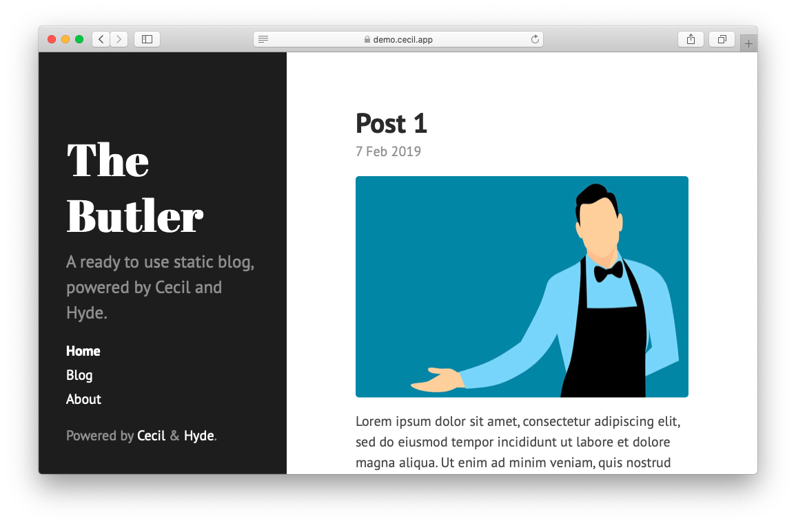

# Hyde theme

> The _Hyde_ theme for [Cecil](https://cecil.app) is a port of the [Hyde](https://github.com/poole/hyde) theme for Jekyll created by [Mark Otto](https://github.com/mdo).



## Installation

```bash
composer require cecil/theme-hyde
```

> Or [download the latest archive](https://github.com/Cecilapp/theme-hyde/releases/latest/) and uncompress its content in `themes/hyde`.

## Usage

Add `hyde` in the `theme` section of your `config.yml`:

```yaml
theme:
  - hyde
```

Configuration:

```yaml
hyde:
  sidebar:
    sticky: true # Content to the bottom of the sidebar
  theme: '' # red, orange, yellow, green, cyan, blue, magenta, brown or cecil
  reverse: false # Reverse layout
```

## License

 _Hyde_ is a free software distributed under the terms of the MIT license.

© [Arnaud Ligny](https://arnaudligny.fr)
